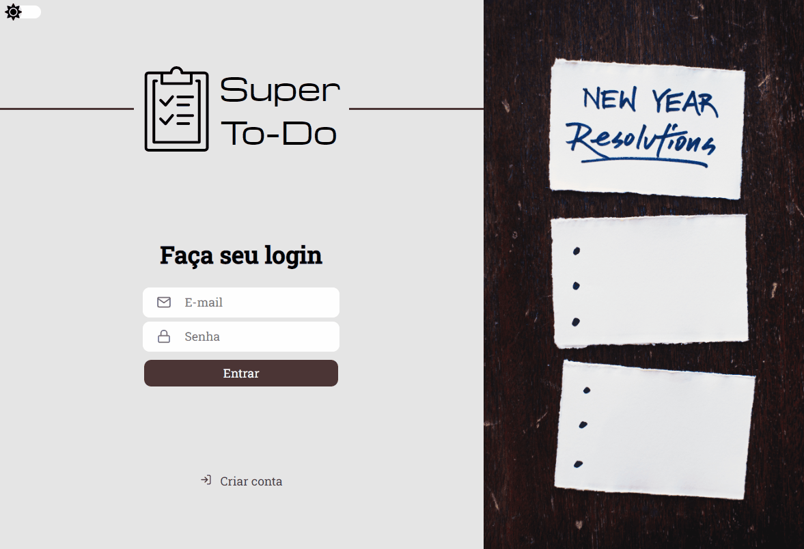
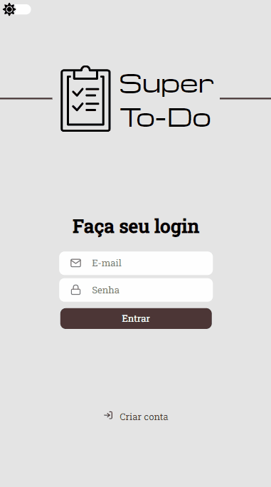

<h1 align="center">Super To-Do</h1>

## 💇🏻‍♂️ Sobre o projeto

Essa é uma API Rest que provê toda a estrutura do banco de dados e da autenticação do usuário.

---

  
  
  

## 🚀 Tecnologias

Esse projeto está sendo desenvolvido com as seguintes tecnologias:

✔️Node.js

✔️Typescript

✔️Express

✔️MongoDB

✔️Bcryptjs

✔️Jsonwebtoken

✔️Cors

✔️Yup

✔️Eslint

✔️Prettier

✔️EditorConfig

## ⚙ Configuração

1- Para instalar as dependências:

> npm install

2- Para iniciar a aplicação:

> npm start

---
